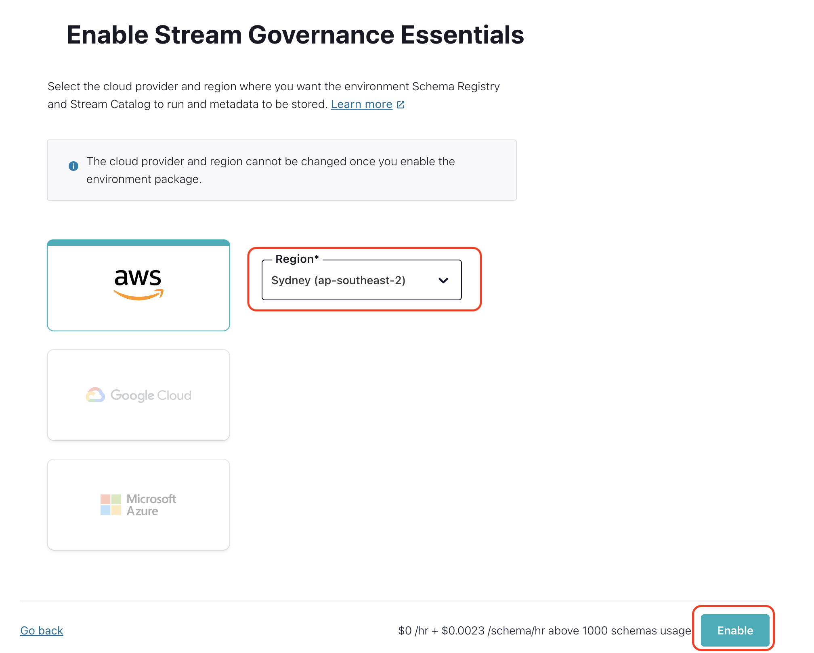

# Prerequisites
*   Access to RDS
*   Access to MongoDB Atlas
*   [Create a Confluent Cloud account](https://www.confluent.io/confluent-cloud/tryfree/)
*   [Install mongosh](https://www.mongodb.com/docs/mongodb-shell/install/) 
*   Ability to execute *curl* command. If curl is not available, please install it
*   [Install Confluent CLI](https://docs.confluent.io/confluent-cli/current/install.html#install-confluent-cli)

# Architecture

 

---

# Setup Clusters

###   `1.  Sign-in using - https://confluent.cloud/login`

---

###   `2.  Create a new environment`

---

###   `3.  Enable Schema Registry - Begin Configuration ->  Essentials Package`

---

###   `4.  Now Create The Kafka Cluster`

---

###   `4.  Now Create KSQLDB Cluster`

---
