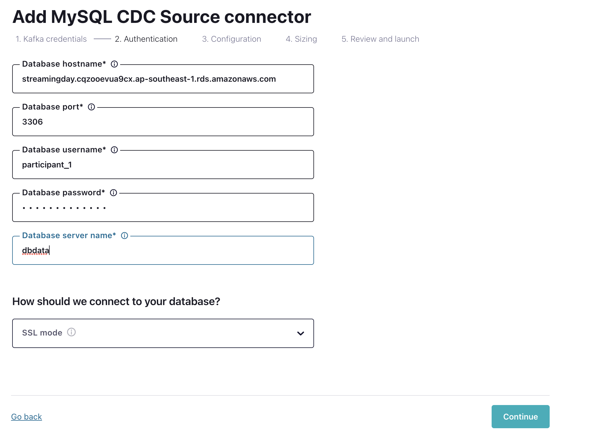

# Prerequisites
*   Access to RDS
*   Access to MongoDB Atlas
*   [Create a Confluent Cloud account](https://www.confluent.io/confluent-cloud/tryfree/)
*   [Install mongosh](https://www.mongodb.com/docs/mongodb-shell/install/) 
*   Ability to execute *curl* command. If curl is not available, please install it
*   [Install Confluent CLI](https://docs.confluent.io/confluent-cli/current/install.html#install-confluent-cli)

# Architecture

 

---

# Setup Clusters

###   `1.  Sign-in using - https://confluent.cloud/login`

---

###   `2.  Create a new environment`

---

###   `3.  Enable Schema Registry - Begin Configuration ->  Essentials Package`

---

###   `4.  Now Create The Kafka Cluster`

---

###   `4.  Now Create The KSQLDB Cluster`

---

###   `5.  Create The MySQL CDC Connector`
*   Host name - globestreamingday.cqzooevua9cx.ap-southeast-1.rds.amazonaws.com
*   Port - 3306
*   DB Name - cdcdb
*   User Name - participant_n (replace with your participant number, for example - participant_1)
*   Password - Same as above
*   Tables - transactions_participant_n, accounts_participant_n (replace with your participant number, for example - participant_1)

---

###   `6.  Check the CDC data generated in the topic`

*   Insert records into tables -      

`INSERT INTO transactions_participant_n (account_id,amount,transaction_type) VALUES ('ACC1',5000,'DEPOSIT');`      

`INSERT INTO accounts_participant_n (account_id,first_name,last_name) VALUES ('ACC1','Suraj','Pillai');`                   

`(change the table names)`      

*   Check corresponding topics for records

---

###   `7.  Create the ksqlDB App streams/tables` 
*   Navigate to the ksqlDB App Editor

*   Enter the commands -   
 

 

`Change the topic name below as appropriate`     

create transactions stream.  
`create stream transactions_stream with (kafka_topic='dbdata.cdcdb.transactions_participant_1', value_format='avro');`    

create new stream based on DEPOSIT/WITHDRAWAL.  
`create stream transaction_type_check_stream with (kafka_topic='transaction_type_check', format='json') as select account_id, case when transaction_type = 'DEPOSIT' then amount else -amount end as amount from transactions_stream where __DELETED = 'false' EMIT CHANGES;`    

create a table which calculates a running account balance.  
`create table account_balance_tbl with (kafka_topic='account_balance', format='json') as select account_id, sum(amount) as account_balance from transaction_type_check_stream as account_balance group by account_id emit changes;`   

`select * from account_balance_tbl emit CHANGES;`    
`(This will show the balance for the account. "Stop" the query once done)`  

create a stream with account details.   
`create stream accounts_stream with (kafka_topic='dbdata.cdcdb.accounts_participant_1', value_format='avro');`   

create table which has the latest details of accounts.    
`create table accounts_tbl with (kafka_topic='account_details', format='json') as select account_id, latest_by_offset(first_name) first_name,latest_by_offset(last_name) last_name from accounts_stream as account_balance group by account_id emit changes;`    

join account and transaction tables to get an unified view.   
`create table transactions_360_tbl with (kafka_topic='transactions_view', value_format='avro', key_format='avro') as select a.account_id a_account_id, as_value(a.account_id) account_id,account_balance, first_name, last_name from account_balance_tbl  a inner join accounts_tbl b on a.account_id=b.account_id;`    

`select * from transactions_360_tbl emit changes;`.    
`(This will show the joined data between transactions and account - transactions will also contain a first name and a last name. "Stop" the query once done)` 

aggregate data to show the number of transactions done in a 5 min period.   
`create table transactions_by_accounts_tbl with (kafka_topic='transactions_by_accounts', format='json') as select account_id, transaction_type ,count(*) as cnt from transactions_stream window tumbling (size 5 minutes) group by account_id,transaction_type;` 

`select * from transactions_by_accounts_tbl emit CHANGES;    
`(This will show the number of transactions by WITHDRAWAL/DEPOSIT. "Stop" the query once done)`

---

###   `8.  Create The MongoDB Sink Connector`

*  Hostname - mongostreaming.whrwcfn.mongodb.net
*  DB Name - mongodb
*  Username - participant_n (replace n with your participant id)
*  Password - participant_n (replace n with your participant id)
*  Collection - transaction_view_participant_n (replace n with your participant id)

---

###   `9.  Observe the data pipeline`

---

###   `10.  Bonus section - to be done by the instructor`

