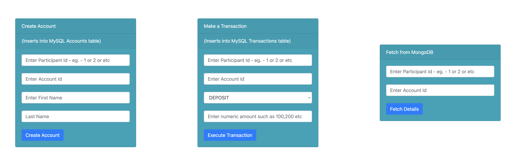
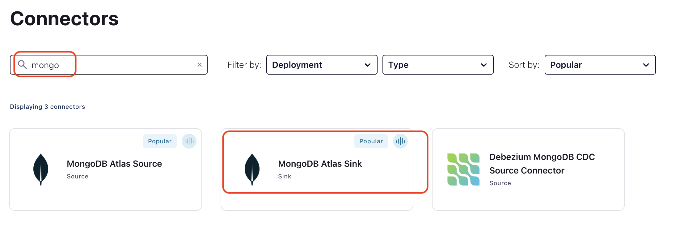

<div align="center" padding=25px>
    
</div>

# <div align="center">Real-Time Data Streaming Pipeline</div>
## <div align="center">Lab Guide</div>


# Prerequisites

1. Access to RDS (MySQL - streamingday.cqzooevua9cx.ap-southeast-1.rds.amazonaws.com   Port:3306)
2. A client to access RDS (DBeaver or equivalent which can connect to a MySQL DB; you may need to download MySQL 8.0 drivers)
3. Access to MongoDB Atlas (mongostreaming.whrwcfn.mongodb.net)
4. Install mongosh (to access mongodb) - https://www.mongodb.com/docs/mongodb-shell/install/
5. Access to http://ec2-13-212-93-248.ap-southeast-1.compute.amazonaws.com:8080 (This would be required if you do not have access to steps 1-4 above)
6. Access to Confluent Cloud
7. Create a Confluent Cloud account - https://www.confluent.io/confluent-cloud/tryfree/
8. Access to https://github.com/suraj-pillai/workshop/blob/main/README.md - which has detailed workshop/lab instructions

```diff
- In case you do not have access to the link http://ec2-13-212-93-248.ap-southeast-1.compute.amazonaws.com:8080. 
- Please use username - participant_0, password - participant_0 in the Connectors and modify other connector parameters with "_0" instead of "_n"
```

---

# Objective

In this workshop you will learn how Confluent Cloud can enable you to quickly and easily stand up a streaming ETL pipeline. During this workshop you’ll get hands-on experience with building out an end-to-end ETL pipeline; from extracting & loading data from out-of-the-box source & target systems with connectors to transforming the data in real-time with ksqlDB all in Confluent Cloud. The source in this case is a MySQL instance which contains Bank Account and Transaction details. You will stream this data into Confluent Cloud, apply transformations on the data using ksqlDB and finally load the transformed data into MongoDB 

---

# Architecture   


<br>


---

# Steps

1. [Sign-in to Confluent Cloud](#step-1)
1. [Create Environment](#step-2)
1. [Enable Schema Registry](#step-3)
1. [Create Kafka cluster](#step-4)
1. [Create ksqlDB App](#step-5)
1. [Create Source Connector(MySQL CDC)](#step-6)
1. [Check CDC Data](#step-7)
1. [Create ksqlDB Streams/Tables](#step-8)
1. [Create MongoDB Sink connector](#step-9)
1. [Observe the data pipeline](#step-10)
1. [Visualize the data pipeline](#step-11)
1. [Bonus section (To be done by the instructor)](#step-12)
1. [Clean up resources](#step-13) 


---

###   <a name="step-1">`1.  Sign-in using - https://confluent.cloud/login`


---


###   <a name="step-2">`2.  Create a new environment`


---

###   <a name="step-3">`3.  Enable Schema Registry - Begin Configuration ->  Essentials Package`


---

###   <a name="step-4">`4.  Now Create The Kafka Cluster`


---


###   <a name="step-5">`5.  Now Create The KSQLDB App`


---

###   <a name="step-6">`6.  Create The MySQL CDC Connector`
    
<div align="center">

| Setting            | Value                        |
|------------------------|-----------------------------------------|
| `Hostname`      | streamingday.cqzooevua9cx.ap-southeast-1.rds.amazonaws.com |
| `Port`      | 3306 |
| `DB Name`              | cdcdb                 |
| `Username`           | participant_n (replace n with your participant id)            |
| `Password`    | participant_n (replace n with your participant id)           |
| `Tables` | cdcdb.transactions_participant_n, cdcdb.accounts_participant_n (replace n with your participant id)              |   
</div>     
    
```diff
- In case you do not have access to the link http://ec2-13-212-93-248.ap-southeast-1.compute.amazonaws.com:8080 - 
- Please use username - participant_0, password - participant_0
- Also, use the tables - transactions_participant_0, accounts_participant_0
```


    
<a name="step-k">     
 
    
    
```diff
- Make sure you download the file and keep it safe; you will need this later
```


---

###   <a name="step-7">`7.  Check the CDC data generated in the topic`


Check the schema associated with the topic


*   Insert records into tables -  

```diff
- Use the following link - http://ec2-13-212-93-248.ap-southeast-1.compute.amazonaws.com:8080
- Use the link to create an account ("Create Account" tile) and create corresponding transactions ("Make a Transaction" tile)
- Do not use the "Fetch From MongoDB" tile yet
- In case you do not have access to http://ec2-13-212-93-248.ap-southeast-1.compute.amazonaws.com:8080 - the instructor will insert data into the DB tables
``` 
    

    
*   Check corresponding topics for records

---

###   <a name="step-8">`8.  Create the ksqlDB App streams/tables` 
*   Navigate to the ksqlDB App Editor


*   Enter the commands -   
 

 

```diff
- Change the topic name (dbdata.cdcdb.transactions_participant_n) below with your participant id  
```
    
create transactions stream.
```sql
`create stream transactions_stream with (kafka_topic='dbdata.cdcdb.transactions_participant_n', value_format='avro');`    
```

    
create new stream based on DEPOSIT/WITHDRAWAL. Also, ignore deletes in the DB table.
```sql
`create stream transaction_type_check_stream with (kafka_topic='transaction_type_check', format='json') as select account_id, case when transaction_type = 'DEPOSIT' then amount else -amount end as amount from transactions_stream where __DELETED = 'false' EMIT CHANGES;` 
```
 
    
create a table which calculates a running account balance.
```sql  
create table account_balance_tbl with (kafka_topic='account_balance', format='json') as select account_id, sum(amount) as account_balance from transaction_type_check_stream as account_balance group by account_id emit changes;   
```
    

```sql
select * from account_balance_tbl emit CHANGES;  
```
`(This will show the balance for the account. "Stop" the query once done)`  

    
create a stream with account details.   
```sql
create stream accounts_stream with (kafka_topic='dbdata.cdcdb.accounts_participant_1', value_format='avro');   
```

    
create table which has the latest details of accounts.    
```sql
create table accounts_tbl with (kafka_topic='account_details', format='json') as select account_id, latest_by_offset(first_name) first_name,latest_by_offset(last_name) last_name from accounts_stream as account_balance group by account_id emit changes;    
```

    
join account and transaction tables to get an unified view.   
```sql
create table transactions_360_tbl with (kafka_topic='transactions_view', value_format='avro', key_format='avro') as select a.account_id a_account_id, as_value(a.account_id) account_id,account_balance, first_name, last_name from account_balance_tbl  a inner join accounts_tbl b on a.account_id=b.account_id;    
```
    
    
```sql
select * from transactions_360_tbl emit changes;    
```
`(This will show the joined data between transactions and account - transactions will also contain a first name and a last name. "Stop" the query once done)` 


aggregate data to show the number of transactions done in a 5 min period.   
```sql
create table transactions_by_accounts_tbl with (kafka_topic='transactions_by_accounts', format='json') as select account_id, transaction_type ,count(*) as cnt,FORMAT_TIMESTAMP(FROM_UNIXTIME(windowstart), 'yyyy-MM-dd HH:mm:ss.SSS', 'Asia/Manila' ) windowstart_readabale,FORMAT_TIMESTAMP(FROM_UNIXTIME(windowend), 'yyyy-MM-dd HH:mm:ss.SSS', 'Asia/Manila' ) windowend_readabale from transactions_stream window tumbling (size 5 minutes) group by account_id,transaction_type EMIT CHANGES;
```

    
```sql
select * from transactions_by_accounts_tbl where account_id='<replace with actual account id>' emit CHANGES;    
```
`(This will show the number of transactions by WITHDRAWAL/DEPOSIT. "Stop" the query once done)`
```diff
- Create transaction using the link, http://ec2-13-212-93-248.ap-southeast-1.compute.amazonaws.com:8080/ and observe the output
```
    


---

###   <a name="step-9">`9.  Create The MongoDB Sink Connector`

<div align="center">

| Setting            | Value                        |
|------------------------|-----------------------------------------|
| `Hostname`      | mongostreaming.whrwcfn.mongodb.net |
| `DB Name`              | mongodb                 |
| `Username`           | participant_n (replace n with your participant id)            |
| `Password`    | participant_n (replace n with your participant id)           |
| `Collection` | transaction_view_participant_n (replace n with your participant id)              |   
</div>     
    
```diff
- In case you do not have access to the link http://ec2-13-212-93-248.ap-southeast-1.compute.amazonaws.com:8080 - 
- Please use username - participant_0, password - participant_0
- Also, use the Collections - transaction_view_participant_0
```




    
[You had downloaded the keys here](#step-k)


*  Check data in MongoDB     
<!--
```diff
- text in red
+ text in green
! text in orange
# text in gray
@@ text in purple (and bold)@@
```
-->

```diff
- Navigate to http://ec2-13-212-93-248.ap-southeast-1.compute.amazonaws.com:8080
- Use the "Fetch From MongoDB" tile
```


    
---

###   <a name="step-10">`10.  Observe the data pipeline`

*  Insert records in RDS(MySQL) and subsequently observe your MongoDB collection
```diff
-  Navigate to http://ec2-13-212-93-248.ap-southeast-1.compute.amazonaws.com:8080
-  Use the link to create transactions ("Make a Transaction" tile)
-  Use the "Fetch From MongoDB" tile to get data from MongoDB
-  You can use ksqlDB and topics UI to verify the data flow
```

---

###   <a name="step-11">`11.  Visualize the data pipeline`
 
View how data flows through the pipeline
    

    

    
---
    
###   <a name="step-12">`12.  Bonus section - to be done by the instructor`
  
*   Send invalid data to a topic and observe behavior

---

###   <a name="step-13">`13.  Clean up the resources`    

Deleting the resources you created during this workshop will prevent you from incurring additional charges.

1. The first item to delete is the ksqlDB application. Select the Delete button under Actions and enter the Application Name to confirm the deletion.

2. Delete the MongoDB sink connector by navigating to **Connectors** in the navigation panel, clicking your connector name, navigate to _settings_,then clicking the trash can icon in the lower left and entering the connector name to confirm the deletion.

3. Delete the MySQL CDC source connector by navigating to **Connectors** in the navigation panel, clicking your connector name, navigate to _settings_,then clicking the trash can icon in the lower left and entering the connector name to confirm the deletion.

4. Delete the Cluster by going to the **Cluster Overview -> Cluster Settings** tab and then selecting **Delete cluster**

5. Delete the Environment by entering the Environment you created and then clicking on **Delete** option available on the right hand side of the page
