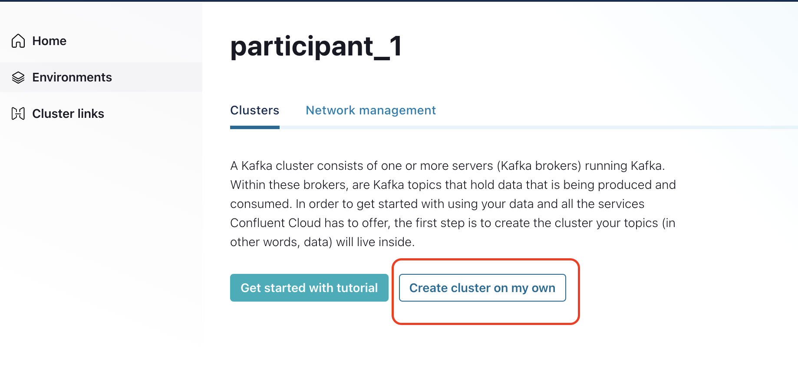
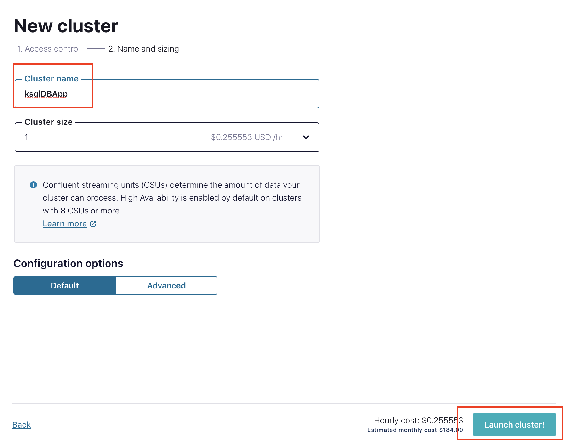
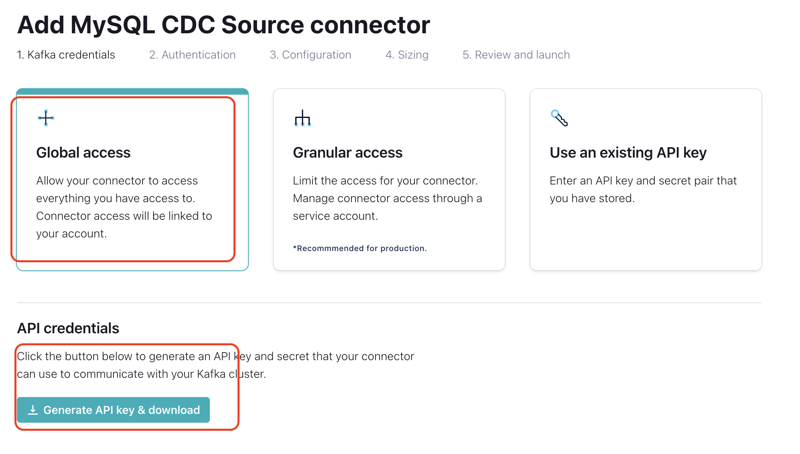

# Prerequisites
*   Access to RDS
*   Access to MongoDB Atlas
*   [Create a Confluent Cloud account](https://www.confluent.io/confluent-cloud/tryfree/)
*   [Install mongosh](https://www.mongodb.com/docs/mongodb-shell/install/) 
*   Ability to execute *curl* command. If curl is not available, please install it
*   [Install Confluent CLI](https://docs.confluent.io/confluent-cli/current/install.html#install-confluent-cli)

# Architecture

 

---

# Setup Clusters

###   `1.  Sign-in using - https://confluent.cloud/login`

---

###   `2.  Create a new environment`

---

###   `3.  Enable Schema Registry - Begin Configuration ->  Essentials Package`

---

###   `4.  Now Create The Kafka Cluster`

---

###   `4.  Now Create The KSQLDB Cluster`

---

###   `5.  Create The MySQL CDC Connector`
*   Host name - globestreamingday.cqzooevua9cx.ap-southeast-1.rds.amazonaws.com
*   Port - 3306
*   DB Name - cdcdb
*   User Name - participant_n (replace with your participant number, for example - participant_1)
*   Password - Same as above
*   Tables - transactions_participant_n, accounts_participant_n (replace with your participant number, for example - participant_1)

---

###   `5.  Check the CDC data generated in the topic`

*   Insert records into tables -      

`INSERT INTO transactions_participant_n (account_id,amount,transaction_type) VALUES ('ACC1',5000,'DEPOSIT');`      

`INSERT INTO accounts_participant_n (account_id,first_name,last_name) VALUES ('ACC1','Suraj','Pillai');`                   

`(change the table names)`      

*   Check corresponding topics for records

